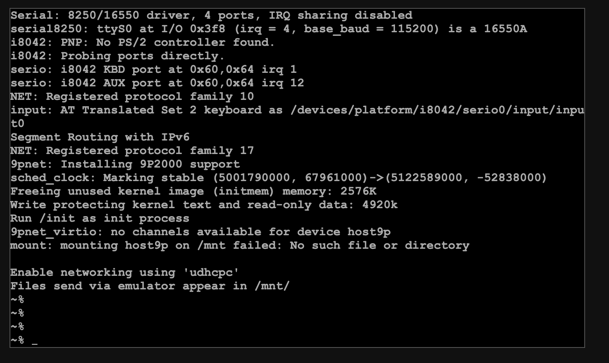

# Blockless WASI-v86 Extension

Blockless WASI-v86 Extension is an emulated v86 machine inside the Blockless Runtime Environment.


## How to build.

### 1. Build wasm 

use the follow command  to generate the wasm file. 
```bash
$ make
```

### 2. Modify the config file.

The follow is the configure file
```
{
    "cdrom": "arch/linux4.iso",
    "bzimage_file": "arch/buildroot-bzimage.bin",
    "bios_file": "arch/seabios-debug.bin",
    "vga_bios_file": "arch/vgabios-debug.bin",
    "wasm_file": "target/v86-debug.wasm",
    "memory_size": 134217728, 
    "vga_memory_size": 8388608,
    "cmdline": ["tsc=reliable mitigations=off random.trust_cpu=on"],
    "logger": {
        "log_file": "debug.log",
        "log_module": ["E", "BIOS"]
    },
    "muiltiboot_order": ["bin", "cdrom"]
}
```

### 3. Run the test linux

use the follow command to run the linux with the configure file.

```bash
$ cargo run -p v86-wasi --release $CONFG_FILE_PATH
```

After run the VM, you can open the "term.html" file for control the VM.





